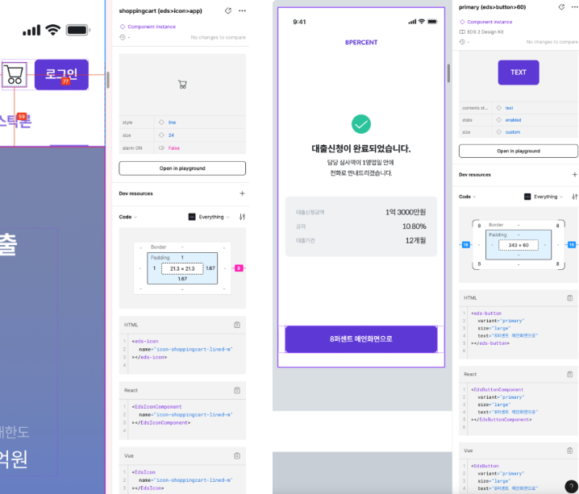

# STEP

1. css를 우리에게 맞춰 변환하기

- 디자인 시스템에 사용된 token값 등

```
// ASIS
borderRadius: "var(--border-radius-md, 8px)",

// TOBE
borderRadius: "md",
```

2. 디자인 시스템에 있는 컴포넌트를 바로 복사 붙여넣기 해서 사용할 수 있도록 코드 제공

- 피그마 시안을 디자인시스템 사용 코드로 자동 변환하여 프론트엔드 개발자의 개발 효율성을 높이고, 디자인 시스템을 사용할 수 있도록 돕는다.
- 피그마 구조에 대한 이해가 좀 필요해 보인다.(componentNode, InstanceNode, ComponentSetNode...)
- 컴포넌트 정보 추출을 위해 디자이너의 도움도 필요할 수 있음

[참고링크](https://8percent.github.io/2024-07-15/frontend-eds-improvement/)


